# 📊 SQL Query Results & Visualizations

## 📌 Screenshots of Executed Queries
- ✅ Query results from **MySQL Workbench**
- ✅ Query results from **phpMyAdmin**
- ✅ Query results from **pgAdmin 4**

## 📈 Visualizations:
- **This is the Database Model**

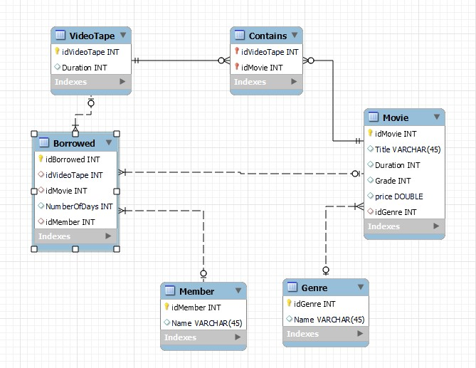

👉 See query results and database visualization in **[SQL_RESULTS.md](documentation/sql_results.md)**
- **Here are some examples of sql queries with results in phpMyAdmin tool**

- Select Title, Duration and Grade of the Movie where Duration is 60 minutes and the grade is minimum 4.
```sql
SELECT Title, Duration, Grade
FROM Movie
WHERE Duration=60
AND Grade>=4;
```

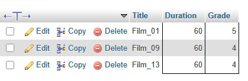

- Select Title, Duration and Grade of the table Movie where Grade is 7, and order by the Duration from the longest to the Shortes Movie.
```sql
SELECT Title, Duration, Grade
FROM Movie
WHERE Grade = 7
ORDER BY Duration DESC;
```

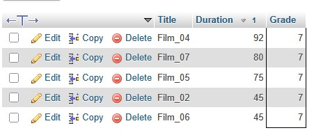

- Fetch the Members Names and the NumberOfDays of borrowed video tapes using Join. Number of Days are organised in ascending manner
```sql
SELECT m.Name, b.NumberOfDays
FROM Member m 
INNER JOIN Borrowed b ON m.idMember=b.idMember 
ORDER BY NumberOfDays ASC;
```

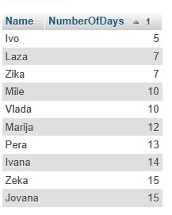

- **Here are some examples of sql queries with results in MySQL tool**

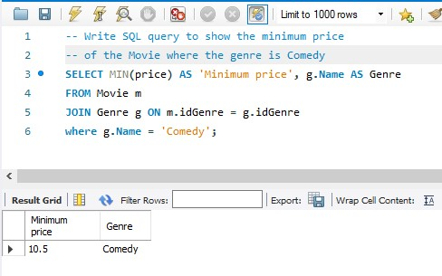


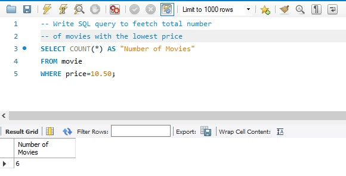


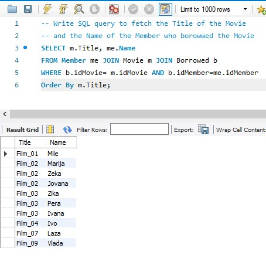


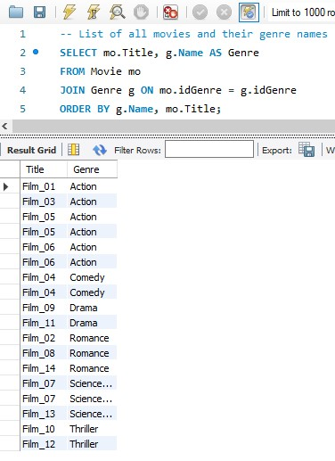

- **Here are some examples of sql queries with results in pgAdmin4 tool**

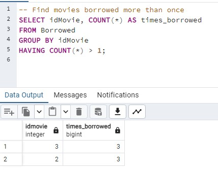


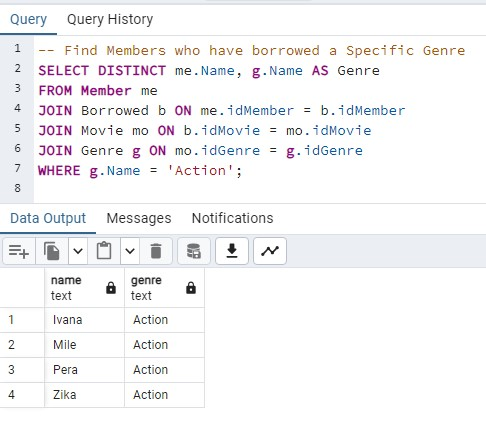


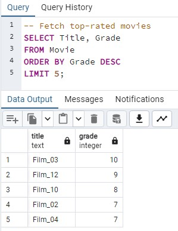


## ⚡ Performance Notes:
- Indexing for **faster query execution**.
- Query optimization **before vs. after indexing**.